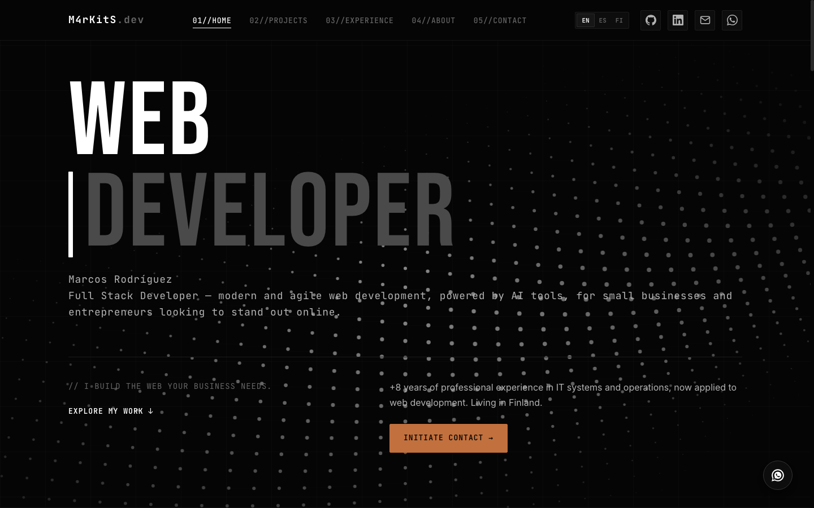

# M4rKitS.dev

> Personal portfolio & freelance brand site — built, optimized, and deployed from scratch.



**Live site:** [m4rkits.dev](https://m4rkits.dev/)

## About

This is the source code for my personal portfolio and freelance web development brand, M4rKitS.dev. It's a single-page site (multi-language: EN/ES/FI) that showcases my projects, experience, and services — built with a deliberate focus on performance, technical SEO, and a distinctive terminal-inspired design, rather than a templated look.

No framework, no build step, no dependencies to install. Just clean HTML, CSS, and JavaScript, deployed on Cloudflare Pages.

## Features

- **Multi-language** — English, Spanish, and Finnish, switchable without a page reload
- **Performance-tuned** — 91/100 mobile and 99/100 desktop on Google PageSpeed Insights
- **Technical SEO done properly** — sitemap, canonical tags, Schema.org structured data (Person), llms.txt for AI/agent discoverability, verified on Google Search Console and Bing Webmaster Tools
- **Accessible, animated project cards** — accordion-style expand/collapse with full keyboard support (aria-expanded, aria-controls) and smooth CSS Grid transitions
- **Working contact form** — EmailJS-powered, with a dedicated thank-you page so submissions are measurable as real conversions in Cloudflare Web Analytics
- **Dark, terminal-inspired UI** — custom design system (Bebas Neue / Inter / JetBrains Mono), not a generic template

## Tech stack

| Layer | Technology |
| --- | --- |
| Structure | HTML5 |
| Styling | CSS3 (custom properties, Grid, Flexbox — no framework) |
| Behavior | Vanilla JavaScript (no build tools) |
| Forms | [EmailJS](https://www.emailjs.com/) |
| Hosting | [Cloudflare Pages](https://pages.cloudflare.com/) |
| Analytics | Cloudflare Web Analytics |

## Project structure

```text
.
├── index.html        # Main portfolio page
├── tbh.html          # Referral landing page (TBH Strategy partnership)
├── gracias.html      # Post-contact-form thank-you page
├── style.css         # All styling
├── script.js         # All interactivity (i18n, forms, accordions, canvas background)
├── translations.js   # EN / ES / FI translation strings
├── sitemap.xml
├── robots.txt
└── llms.txt          # Structured summary for AI agents/crawlers
```

## Development workflow

Built using an AI-agent-assisted development workflow (Google Antigravity + Claude), with every change scoped through a written prompt, reviewed, and tested in production before being called done. This isn't "vibe coding" — every feature ships with real QA: cross-browser checks, cache-busting version bumps, and manual verification on the live domain, not just localhost.

## Local development

No build step required. Clone the repo and serve it with any static file server:

```bash
git clone https://github.com/M4rKitS/web-personal-cloudfare.git
cd web-personal-cloudfare
python3 -m http.server 8080
```

Then open `http://localhost:8080`.

## Contact

- **Web:** [m4rkits.dev](https://m4rkits.dev/)
- **Email:** contact@m4rkits.dev
- **LinkedIn:** [linkedin.com/in/mrodriguezhdz](https://linkedin.com/in/mrodriguezhdz)
- **GitHub:** [@M4rKitS](https://github.com/M4rKitS)